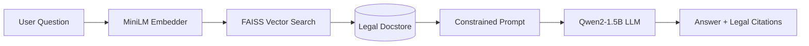

# 🏛️ Vietnamese Legal RAG Chatbot

A Retrieval-Augmented Generation (RAG) system for accurate Vietnamese legal Q&A with zero hallucination.


## 🔄 System Architecture



---

## 📌 Features
- **Retrieval-Augmented Generation (RAG)**: Dense vector retrieval combined with LLM generation.
- **Fast Vector Search**: Powered by **FAISS** & `paraphrase-multilingual-MiniLM-L12-v2`.
- **Fact-Based Generation**: `Qwen2-1.5B-Instruct` strictly constrained to retrieved context.
- **Hardware-Adaptive**: Auto-detects GPU (CUDA `float16`) vs CPU (`float32`).
- **Web UI**: Interactive interface built with **Gradio**.

---

## 📂 Project Structure
```text
laws/
├── app/
│   ├── GUI.py           # Gradio Web Interface
│   └── rag_engine.py    # Core RAG Pipeline
├── artifacts/
│   ├── config.json      # Model configurations
│   ├── faiss.index      # FAISS Vector Index
│   └── docstore.pkl     # Legal text & citations
├── data/                # Datasets & benchmarks
├── requirements.txt     # Dependencies
└── README.md
```

---

## 🛠️ Quick Start

### 1. Installation
```bash
git clone https://github.com/Ein05/vietnam_law_chatbot.git
cd vietnam_law_chatbot
pip install -r requirements.txt
```

### 2. Run Application
```bash
python app/GUI.py
```
Open browser at `http://127.0.0.1:7860`.

---

## 📊 Tech Stack
- **Embedding**: `sentence-transformers/paraphrase-multilingual-MiniLM-L12-v2`
- **LLM**: `Qwen/Qwen2-1.5B-Instruct`
- **Vector DB**: `FAISS`
- **Interface**: `Gradio`
- **Dataset**: [Vietnamese Legal Dataset (Kaggle)](https://www.kaggle.com/datasets/quangbut/vietnamese-legal)
